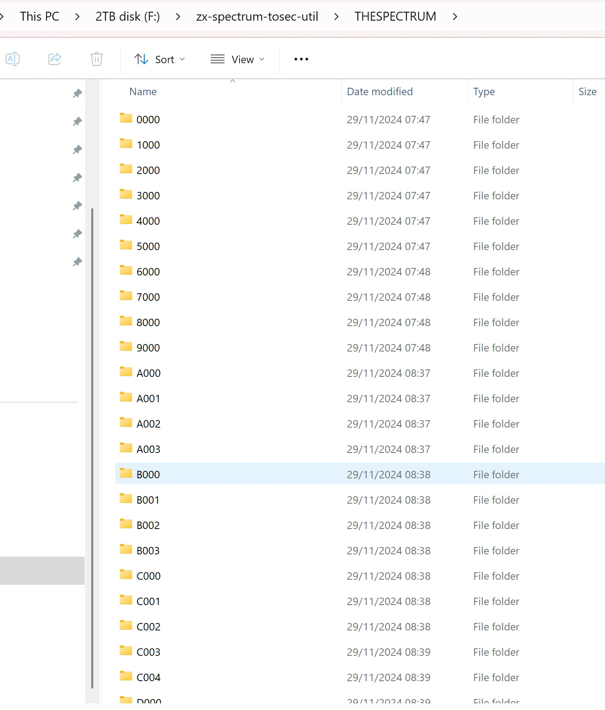

<h3>ZX Spectrum TOSEC Utility Script</h3>

A <a href="https://deno.com">Deno</a> utility

A deno program to convert the [TOSEC](https://archive.org/details/zx_spectrum_tosec_set_september_2023) collection of ZX Spectrum games into a structure suitable for use with  games console.

## Running The Script

- Clone this repo
- Download the latest from [TOSEC](https://archive.org/details/zx_spectrum_tosec_set_september_2023) [Games.zip](https://archive.org/download/zx_spectrum_tosec_set_september_2023/Games.zip) and unzip it into the repo folder, so you should have a folder called "Games".
- Run `deno task dev`

This will move the game files with supported extensions (tap, tzx, pzx, rom, szx, z80, sna, m3u) into a compatible folder structure under `/THESPECTRUM` directory. As The Spectrum only supports up to 256 files per folder the games are split alphabetically (#, A...Z) and numerically (A0...A3). See:

[NOTE!] In order to increase compatibility this utilty also downloads the original Spectrum ROMs from [FBZX](https://github.com/rastersoft/fbzx) into a `/THESPECTRUM/roms` folder.

Copy THESPECTRUM folder to a suitable USB, plug in to [The Spectrum](https://www.youtube.com/watch?v=EnfQ13nFJYc) & enjoy!
